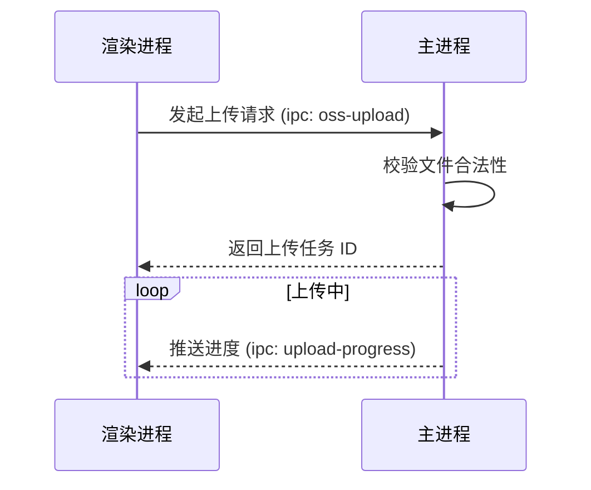

# 模块文档生成器

本技能用于分析指定目录（通常位于 `src/main/modules` 或 `src/renderer/views` 下），并生成一份包含架构说明与业务逻辑图解的 `README.md` 文档。

## 使用流程

1.  **确认目标目录**：明确用户希望为哪个目录生成文档。如果用户未指定，请询问目录路径。
2.  **深度分析目录**：
    *   列出该目录下的所有文件。
    *   阅读核心文件（如 `index.ts`, `service.ts`, `controller.ts`, `*.vue`, `hooks/*.ts` 等）。
    *   理解该模块的核心职责、数据流向以及状态管理机制。
3.  **生成文档内容**：
    *   在目标目录下创建或更新 `README.md` 文件。
    *   **文档结构建议**：
        *   `# [模块名称] 模块/页面说明`
        *   `## 1. 核心职责`：简明扼要地描述该模块是做什么的。
        *   `## 2. 关键文件索引`：列出重要文件及其作用，方便 AI 快速定位。
        *   `## 3. 核心逻辑图解 (Mermaid)`：
            *   **时序图 (Sequence Diagram)**：用于展示复杂交互（如 IPC 通信、API 调用链）。
            *   **状态图 (State Diagram)**：用于展示状态流转（如上传状态、表单验证状态）。
            *   **类图 (Class Diagram)**：用于展示类结构（如 Service/Adapter 模式）。
            *   **流程图 (Flowchart)**：用于展示业务决策逻辑。
        *   `## 4. 注意事项`：记录开发陷阱、依赖关系或潜在的副作用。

## 输出示例

```markdown
# OSS 模块说明文档

## 1. 核心职责
负责处理所有对象存储（OSS）相关操作，包括文件上传、下载、删除以及 Bucket 管理。

## 2. 关键文件索引
- `oss.service.ts`: 封装 OSS 操作的核心业务逻辑。
- `oss.controller.ts`: 处理来自渲染进程的 IPC 请求，并调用 Service 层。
- `adapter/Base.ts`: 定义多云支持的抽象适配器基类。

## 3. 核心逻辑图解

### 上传流程时序图


## 4. 注意事项
- 请确保 `ali-oss` SDK 版本保持最新。
- 修改适配器接口时，需同步更新所有子类实现。
```
