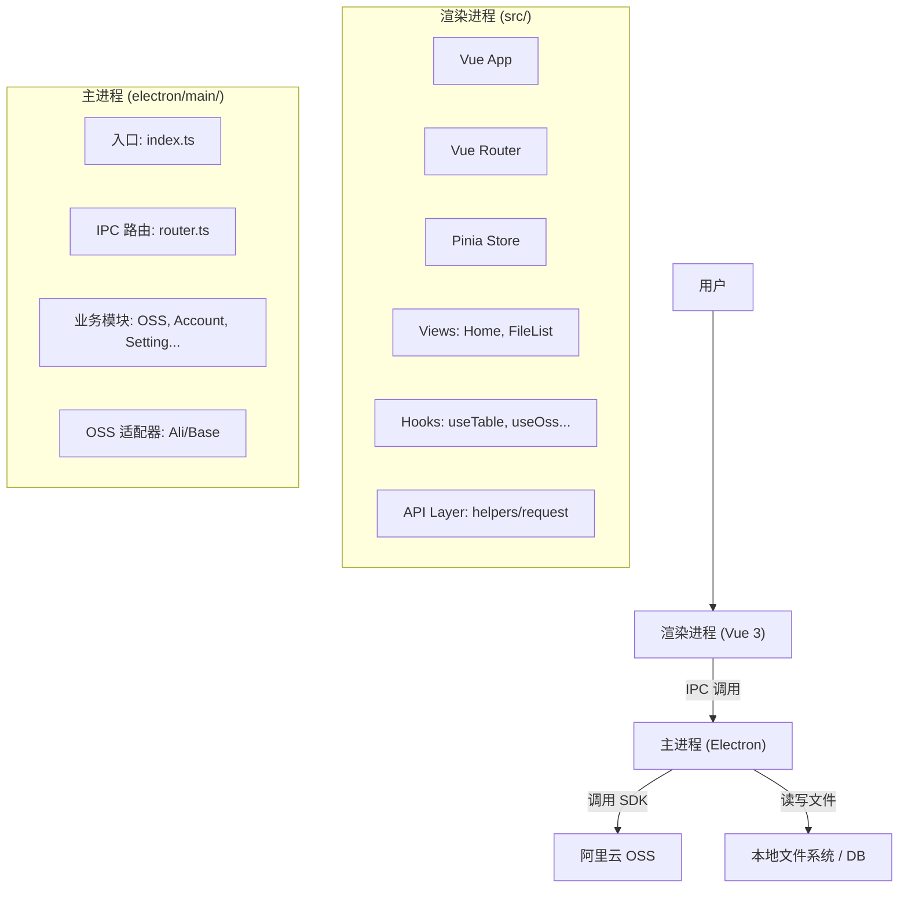

# OSS Browser 架构说明

> 文档最后更新时间：2026-02-17
> 本文档旨在帮助开发者快速理解 `oss-browser` 项目的整体架构、核心模块与扩展方式。

## 1. 项目简介

**OSS Browser** 是一个跨平台的 OSS（对象存储服务）可视化管理客户端，基于 Electron 和 Vue 3 开发。它旨在提供类似本地文件管理器的操作体验，支持多账号管理、文件上传下载、目录操作、图片预览等核心功能，并集成了收藏夹、历史记录、自定义复制模板等效率工具。

目前主要适配 Ali OSS，设计上保留了对其他云厂商的扩展接口。

## 2. 技术栈与运行环境

| 类别          | 技术选型           | 说明                         |
| :------------ | :----------------- | :--------------------------- |
| **运行时**    | Electron           | 跨平台桌面应用框架           |
| **前端框架**  | Vue 3 + TypeScript | Composition API 风格         |
| **UI 组件库** | Element Plus       | 配合 SCSS 定制样式           |
| **状态管理**  | Pinia              | 轻量级状态管理               |
| **路由管理**  | Vue Router         | 页面导航                     |
| **构建工具**  | Vite               | 极速开发与构建               |
| **打包工具**  | electron-builder   | 生成各平台安装包             |
| **OSS SDK**   | ali-oss            | 阿里云 OSS 官方 SDK          |
| **本地存储**  | lowdb / fs-extra   | 轻量级 JSON 数据库与文件操作 |

## 3. 运行时架构

本项目采用标准的 Electron 双进程架构：



- **主进程 (Main Process)**：负责应用生命周期、窗口管理、本地文件读写、以及与 OSS 服务的交互。所有涉及系统级操作（文件、网络、数据库）的逻辑均在主进程完成。
- **渲染进程 (Renderer Process)**：负责 UI 展示与用户交互。通过 IPC (Inter-Process Communication) 向主进程发送指令并接收数据。
- **预加载脚本 (Preload Script)**：虽然存在 `electron/preload/index.ts`，但本项目目前主要通过 `ipcRenderer.invoke` 进行通信，保持了较低的耦合度。

## 4. 目录结构概览

### 4.1 根目录

- `electron/`: 主进程代码
- `src/`: 渲染进程（前端）代码
- `public/`: 静态资源（图标等）
- `scripts/`: 构建脚本
- `checklist/`: 功能检查清单（文档）

### 4.2 主进程 (`electron/main/`)

| 目录/文件          | 说明         | 关键类/函数                  |
| :----------------- | :----------- | :--------------------------- |
| `index.ts`         | 主进程入口   | `createApp`, `BrowserWindow` |
| `router.ts`        | IPC 路由定义 | `ipcMain.handle`             |
| `modules/`         | 业务模块     | 包含 `controller`, `service` |
| `modules/oss/`     | OSS 核心模块 | `oss.service.ts`             |
| `modules/account/` | 账号管理     | `account.service.ts`         |
| `helper/`          | 工具函数     | `response`, `sql`            |

### 4.3 渲染进程 (`src/`)

| 目录/文件         | 说明         | 关键组件/Hook                  |
| :---------------- | :----------- | :----------------------------- |
| `main.ts`         | Vue 入口     | `createApp`                    |
| `views/home/`     | 登录/账号页  | `index.vue`, `useLogin`        |
| `views/fileList/` | 文件列表主页 | `index.vue`, `useTable`        |
| `helpers/`        | 通用工具     | `request.ts` (IPC封装)         |
| `store/`          | Pinia 状态   | (暂未大规模使用，主要靠 Hooks) |

## 5. 核心文档索引

为了保持文档清晰，详细的设计说明已拆分为以下文档：

- **[IPC 通信协议 (ipc.md)](./ipc.md)**：详细列出了前端与主进程通信的所有频道 (Channel)、参数及返回结构。**新增 API 时请更新此文档。**
- **[模块详细设计 (modules.md)](./modules.md)**：深入讲解 OSS、账号、设置等核心模块的内部实现逻辑与数据流。
- **[开发与扩展指南 (guide.md)](./guide.md)**：手把手教你如何新增一个功能、调试技巧以及打包发布流程。

## 6. 快速开始

### 安装依赖

```bash
npm install
```

### 启动开发环境

```bash
npm run dev
```

这将同时启动 Vite 开发服务器（渲染进程）和 Electron（主进程）。

### 构建应用

```bash
npm run build
```

构建产物将输出到 `dist/` 或 `release/` 目录。

## 7. 约定与最佳实践

1.  **IPC 通信封装**：前端严禁直接调用 `ipcRenderer.invoke`，必须在 `src/helpers/request.ts` 或各模块的 `api.ts` 中封装强类型的 API 函数。
2.  **业务逻辑分离**：Vue 组件 (`.vue`) 应专注于 UI 展示，复杂的业务逻辑（如文件筛选、状态管理）应抽离到 `hooks/` 目录下的 Composition API 函数中。
3.  **主进程分层**：主进程应遵循 `Router` -> `Controller` -> `Service` -> `Repository/Adapter` 的分层架构，避免在 `router.ts` 中写具体业务逻辑。
4.  **类型安全**：前后端共享的类型定义应放在 `src/shared/types.ts` 或 `electron/main/types/` 中，保持数据结构的一致性。
