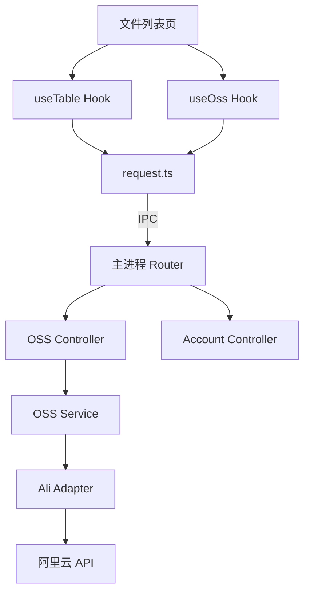

# 模块详细设计

本文档深入解析 `oss-browser` 各核心业务模块的设计与实现。

## 1. 账号模块 (Account Module)

### 职责
- 管理用户添加的 OSS 账号（AccessKeyId, AccessKeySecret, Bucket 等）。
- 记录最后一次登录的账号 ID，实现自动登录。

### 实现细节
- **数据存储**：使用 `lowdb` 本地 JSON 文件存储账号列表。
- **主进程逻辑**：
  - `account.controller.ts`: 处理 IPC 请求，调用 Service。
  - `account.service.ts`: 负责增删改查逻辑。
- **关键流程**：
  - 启动应用 -> 读取默认账号 ID -> 获取账号详情 -> 初始化 OSS 适配器 -> 自动进入文件列表。

## 2. OSS 模块 (OSS Module)

### 职责
- 封装不同云厂商的 OSS 操作接口。
- 处理文件上传、下载、删除、重命名等核心业务。
- 处理大文件上传的分片逻辑与进度回调。

### 架构设计
采用**适配器模式 (Adapter Pattern)** 实现多云支持：

```typescript
// electron/main/modules/oss/adapter/Base.ts
abstract class BaseAdapter {
  abstract getFileList(params: ListParams): Promise<FileListResponse>;
  abstract upload(file: File): Promise<UploadResponse>;
  abstract delete(path: string): Promise<void>;
  // ...
}

// electron/main/modules/oss/adapter/Ali/Impl.ts
class AliOSSAdapter extends BaseAdapter {
  // 实现具体的阿里云 OSS 调用逻辑
}
```

### 关键逻辑
1.  **文件列表获取**：前端请求 `oss-get-list` -> 主进程调用 `currentApp.getFileList` -> 返回统一格式的 `FileItem[]`。
2.  **文件上传**：
    - 支持文件与文件夹拖拽上传。
    - 文件夹上传通过 `fs.readdir` 递归读取所有文件。
    - 使用 `RxJS` 处理上传进度流，并通过 `oss-upload-receiver` 频道实时推送给前端。

## 3. 设置模块 (Setting Module)

### 职责
- 管理应用级配置，如图片预览倍率、默认首页、复制模板 ID 等。

### 实现细节
- 配置存储在本地 JSON 数据库中。
- 前端通过 `useSetting` Hook 获取配置，并根据配置调整 UI（如是否显示图片缩略图）。

## 4. 收藏与历史 (Collect & History)

### 收藏模块
- **功能**：允许用户将常用的 OSS 路径（如 `images/2023/work/`）添加到收藏夹。
- **实现**：简单的增删改查，数据持久化存储。前端通过 `CollectPane.vue` 组件展示。

### 历史模块
- **功能**：自动记录用户上传成功的文件历史。
- **实现**：
  - 上传完成时，OSS 模块触发事件。
  - History 模块监听事件并将记录写入数据库。
  - 前端支持分页查询历史记录。

## 5. 模板与工作流 (Template & Workflow)

### 模板模块 (Template)
- **痛点**：运营人员上传图片后，往往需要拼接成特定的 HTML/Markdown 格式。
- **解决方案**：允许用户自定义“复制模板”，支持变量替换（如 `${url}`, `${name}`, `${width}`）。
- **实现**：
  - 前端提供模板编辑器 (`TemplateEditor.vue`)。
  - 复制时，主进程根据选中的模板 ID，用当前文件信息替换模板变量，生成最终字符串并写入剪贴板。

### 工作流模块 (Workflow)
- **功能**：支持上传后的自动化处理（如自动重命名、自动归档等，目前处于基础阶段）。

## 6. 前端业务模块 (Views)

### 登录页 (`views/home`)
- 职责：展示账号列表，提供新增账号入口。
- 逻辑：使用 `useLogin` Hook 处理表单提交与登录跳转。

### 文件列表页 (`views/fileList`)
这是应用最复杂的页面，拆分为多个 Hook 和组件：
- **`useTable`**: 核心文件列表数据管理（加载、筛选、排序）。
- **`useBreadcrumb`**: 面包屑导航逻辑，管理当前路径 `currentPath`。
- **`useOss`**: 封装上传、下载、删除等操作的交互逻辑。
- **`usePreview`**: 图片预览弹窗逻辑。
- **`components/FileList.vue`**: 文件表格展示组件。
- **`components/UploadHistory.vue`**: 上传历史抽屉。

## 7. 模块关系图


