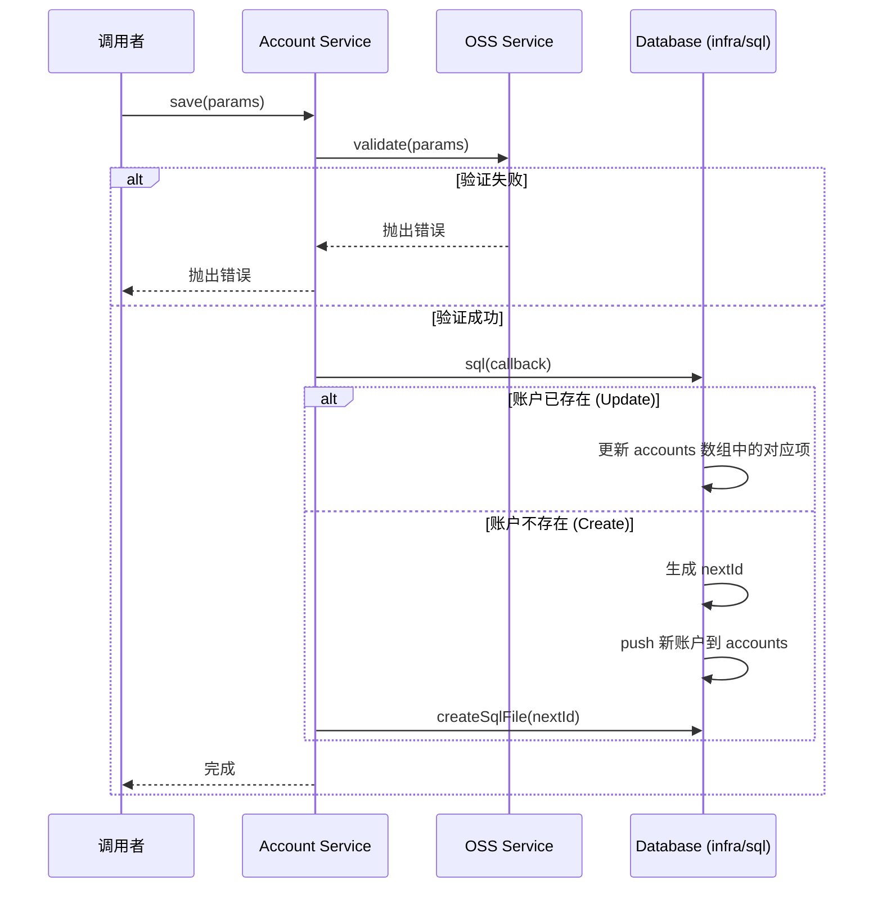
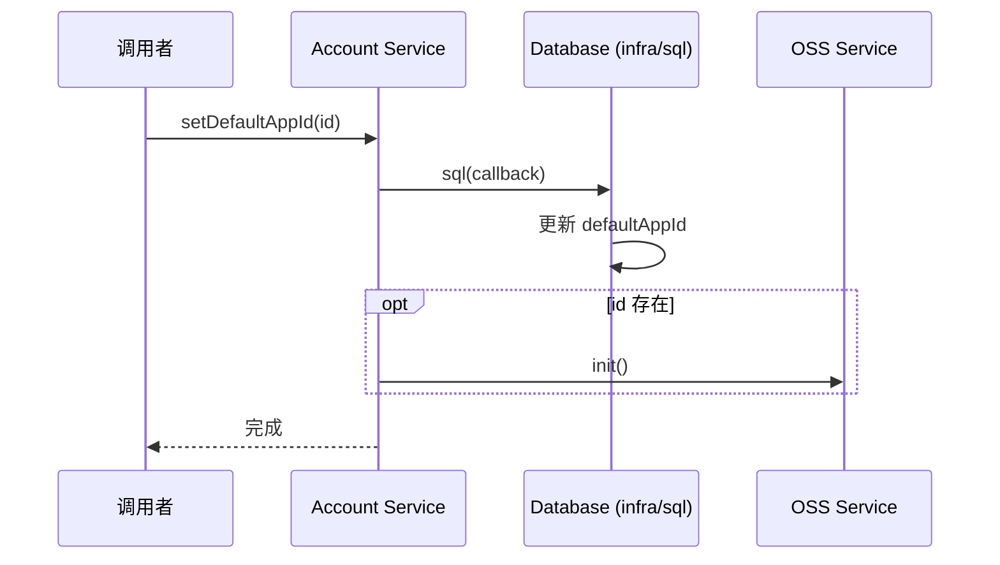

# Account 模块说明文档

## 1. 核心职责
Account 模块主要负责管理用户账户信息，包括账户的增删改查（CRUD）操作，以及默认应用 ID 的管理。它充当了应用层与底层数据存储（通过 `infra/sql`）之间的桥梁，并与 OSS 模块有一定的交互（验证和初始化）。

## 2. 关键文件索引
- [account.service.ts](account.service.ts): 核心服务文件，包含所有账户管理的业务逻辑函数。

## 3. 核心逻辑图解

### 保存账户流程 (Save Account)

### 设置默认应用 ID 流程 (Set Default App ID)

## 4. 注意事项
- **依赖关系**: 本模块依赖 `../../infra/sql` 进行数据持久化，依赖 `../oss/oss.service` 进行参数验证 (`validate`) 和服务初始化 (`init`)。
- **ID 生成**: 新账户的 ID 是基于当前最大 ID 自增生成的。
- **副作用**: 创建新账户时会调用 `createSqlFile`，这可能会在文件系统中创建新的 SQL 文件。设置默认 App ID 时会触发 OSS 服务的初始化。
