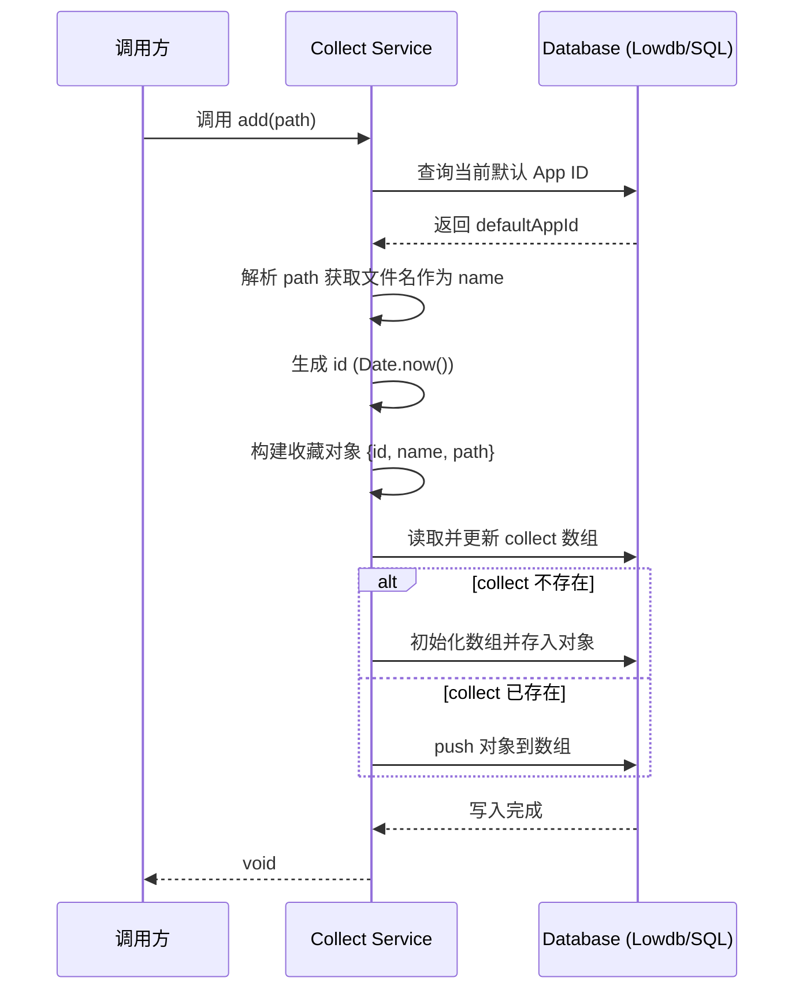

# Collect 模块说明文档

## 1. 核心职责
本模块负责管理用户的“收藏夹”数据。它提供了对收藏项（通常是文件或目录路径）的持久化存储管理，包括获取列表、添加新项以及全量更新列表。数据存储在应用的本地数据库中，与特定的应用实例（App ID）关联。

## 2. 关键文件索引
- [collect.service.ts](collect.service.ts): 核心服务层实现。包含 `get`（获取）、`add`（添加）、`set`（设置）三个主要函数，负责具体的业务逻辑和数据库交互。

## 3. 核心逻辑图解

### 3.1 数据结构
收藏项（Collect Item）主要包含以下字段：
- `id`: 唯一标识符 (当前实现使用时间戳字符串)
- `name`: 显示名称 (从路径中解析的文件/目录名)
- `path`: 原始路径字符串

### 3.2 添加收藏流程 (Add)

## 4. 注意事项
1.  **ID 生成策略**：目前使用 `Date.now().toString()` 生成 ID。在极高并发下（例如毫秒级连续点击）理论上可能重复，但在用户交互场景下通常是安全的。
2.  **路径解析**：`name` 字段是通过 `path.split('/').filter(...).at(-1)` 获取的，这意味着它假设路径分隔符为 `/`。在 Windows 环境下如果路径使用 `\` 可能需要注意兼容性（或者前端传递的路径已经标准化为 `/`）。
3.  **数据隔离**：所有操作都依赖于 `db.defaultAppId`，确保了操作的是当前激活应用的数据。
