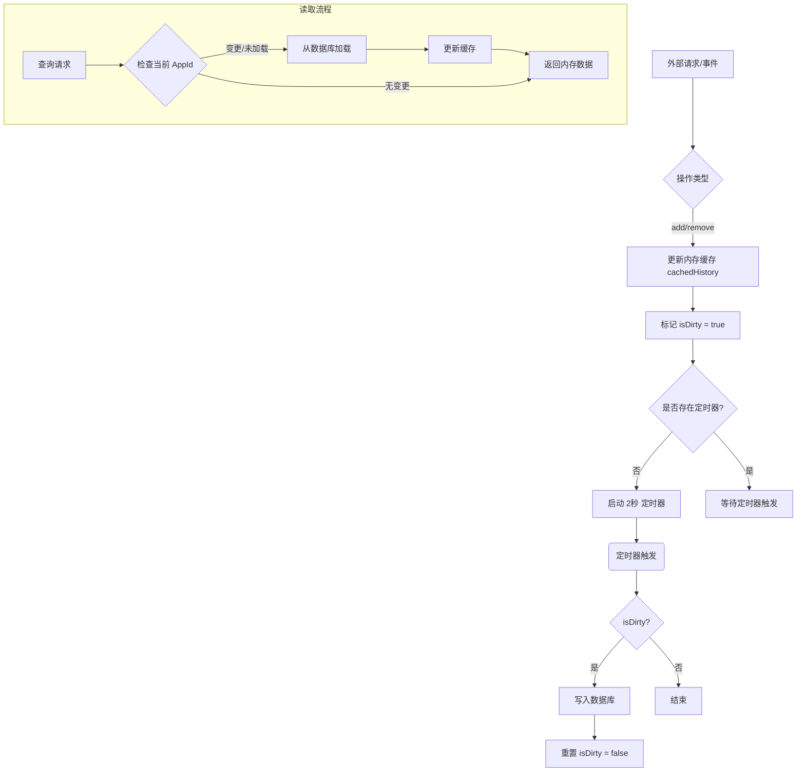
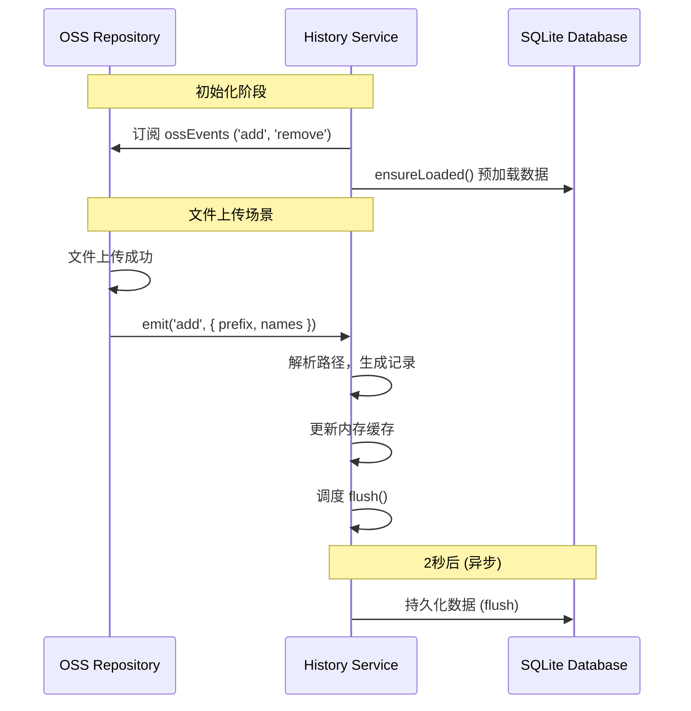

# History 模块说明文档

## 1. 核心职责

History 模块负责管理和持久化对象存储（OSS）的操作历史记录。主要功能包括：

- **记录操作**：自动记录文件的上传（新增）和删除操作。
- **数据查询**：提供分页查询接口，支持按时间倒序查看历史记录。
- **数据同步**：监听 OSS 模块的事件流，自动同步操作记录。
- **性能优化**：采用“内存缓存 + 定时刷盘”策略，减少频繁的数据库 I/O 操作。

## 2. 关键文件索引

- [history.service.ts](file:///Users/linzhibin/Documents/GitHub/oss-browser/src/main/modules/history/history.service.ts): 核心业务逻辑实现。
  - 维护内存中的历史记录缓存 (`cachedHistory`)。
  - 实现数据持久化逻辑 (`flush`, `ensureLoaded`)。
  - 监听 `ossEvents` 并响应 `add`/`remove` 事件。

## 3. 核心逻辑图解

### 3.1 数据加载与刷盘机制

该模块通过维护一个脏标记 (`isDirty`) 和定时器 (`flushTimer`) 来批量写入数据库，避免高频写入。

### 3.2 OSS 事件响应时序图

History 模块并不直接被 Controller 调用，而是通过订阅 OSS 模块的事件来被动更新。

## 4. 注意事项

1. **数据隔离**：历史记录是基于 `appId` 进行隔离的。在 `ensureLoaded` 中会检查 `currentAppId`，如果发生变化会重新加载数据。
2. **单例模式**：模块内的状态（`cachedHistory`, `currentAppId` 等）是模块级变量，这意味着该服务在主进程中是单例运行的。
3. **事件依赖**：强依赖 `../../infra/sql` 进行数据库操作，以及 `../oss/oss.repository` 中的 `ossEvents` 进行事件通信。
4. **路径处理**：在记录路径时，会自动将反斜杠转换为斜杠 (`slash`) 并处理路径拼接。

