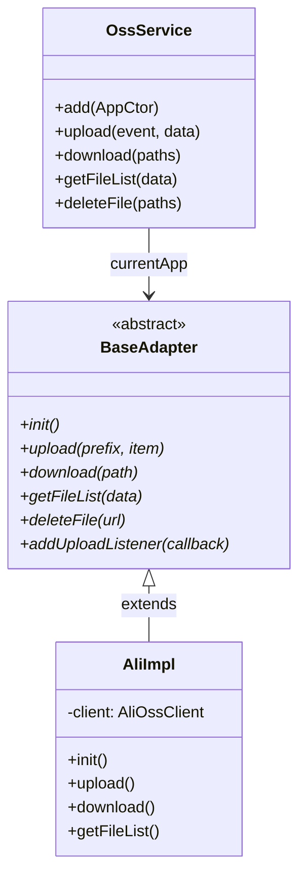
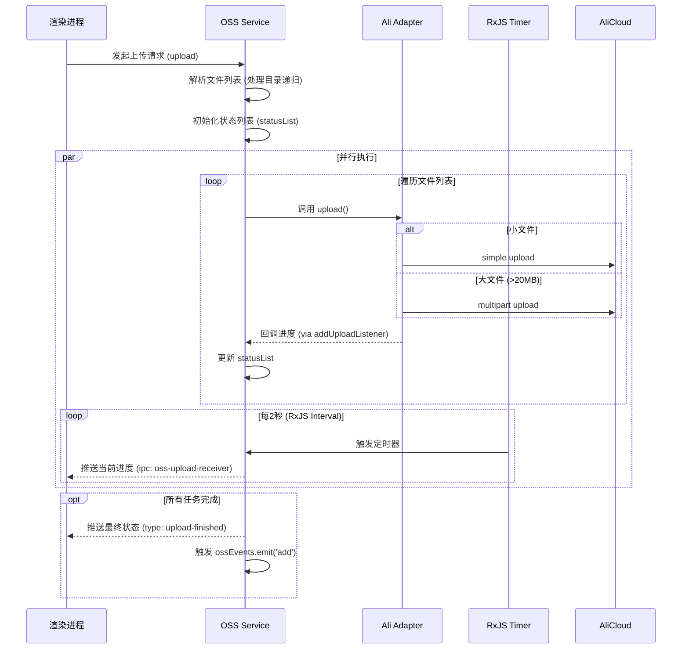

# OSS 模块说明文档

## 1. 核心职责

本模块负责应用程序的对象存储服务（OSS）统一管理。它采用适配器模式设计，旨在支持多种云存储服务商（目前已实现阿里云 OSS）。主要功能包括：

- **文件管理**：文件的上传、下载、删除。
- **目录管理**：创建目录、递归上传文件夹、获取文件列表。
- **多云适配**：通过统一的接口屏蔽不同云厂商 SDK 的差异。
- **进度管理**：管理文件上传任务的状态，并向渲染进程推送进度信息。

## 2. 关键文件索引

| 文件路径 | 说明 |
| :--- | :--- |
| `oss.service.ts` | **核心业务层**。对外暴露统一 API，处理 IPC 事件，负责文件/目录的预处理（如递归读取本地目录），并管理上传任务的生命周期（进度监听、状态更新、完成通知）。 |
| `adapter/Base.ts` | **抽象基类**。定义了所有 OSS 适配器必须实现的接口规范（如 `upload`, `download`, `getFileList` 等）。 |
| `adapter/Ali/Impl.ts` | **阿里云适配器**。继承自 `Base`，基于 `ali-oss` SDK 实现了具体的 OSS 操作逻辑，包含分片上传和断点续传的底层处理。 |
| `oss.dto.ts` | **类型定义**。定义了模块交互所需的数据结构，如 `AddOptions`（上传参数）、`IFileItem`（文件对象）等。 |
| `oss.repository.ts` | **事件总线**。导出了 `ossEvents` (EventEmitter)，用于在文件增删操作完成后广播事件。 |

## 3. 核心逻辑图解

### 3.1 模块类结构图 (Class Diagram)

### 3.2 上传流程时序图 (Sequence Diagram)

## 4. 注意事项

1.  **上传进度推送机制**：
    为了避免频繁 IPC 通信导致性能问题，上传进度并非实时推送。`oss.service.ts` 使用 RxJS 的 `interval(2000)` 创建了一个定时器，每 **2秒** 采样一次当前的 `statusList` 并发送给渲染进程。

2.  **大文件上传策略**：
    在 `adapter/Ali/Impl.ts` 中，会根据 `sizeBoundary` (默认为 20MB) 判断上传方式。
    - 小于 20MB：使用普通 `put` 上传。
    - 大于 20MB：自动切换为 `multipartUpload` (分片上传)，并支持进度回调。

3.  **下载依赖**：
    下载功能的实现 (`adapter/Ali/Impl.ts`) 依赖于 `util/util.service` 模块提供的通用下载能力。它会先解析出所有需要下载的文件 URL，然后批量调用下载服务。

4.  **适配器扩展**：
    若需添加新的云存储支持（如腾讯云、AWS S3），需在 `adapter/` 目录下新建实现类，继承 `Base.ts` 并实现所有抽象方法，最后在应用启动时通过 `oss.service.ts` 的 `add()` 方法注册。
