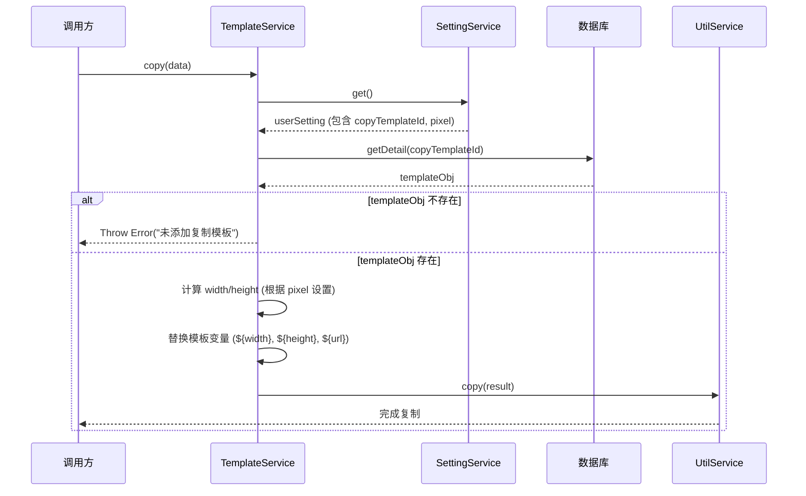

# Template 模块说明文档

## 1. 核心职责
该模块负责管理用户自定义的模板数据，主要用于生成特定格式的字符串（例如 HTML 代码片段、Markdown 链接等），并支持将处理后的模板内容复制到剪贴板。它提供了模板的增删改查（CRUD）功能，以及基于模板进行变量替换和复制的核心业务逻辑。

## 2. 关键文件索引
- `template.service.ts`: 核心服务层，封装了所有的模板管理逻辑和数据库交互操作。

## 3. 核心逻辑图解

### 复制模板流程时序图

## 4. 注意事项
- **变量替换**：模板内容支持变量替换，目前支持的变量包括 `${width}`, `${height}`, `${url}`。
- **依赖配置**：`copy` 方法依赖于 `settingService` 中的 `copyTemplateId` 配置，如果该配置无效或对应的模板不存在，操作将失败。
- **性能优化**：`getList` 方法返回的列表中不包含 `content` 字段，以减少数据传输量；如需获取完整内容，需调用 `getDetail`。
- **数据持久化**：数据库操作依赖于 `../../infra/sql` 模块提供的 `sql` 函数。
