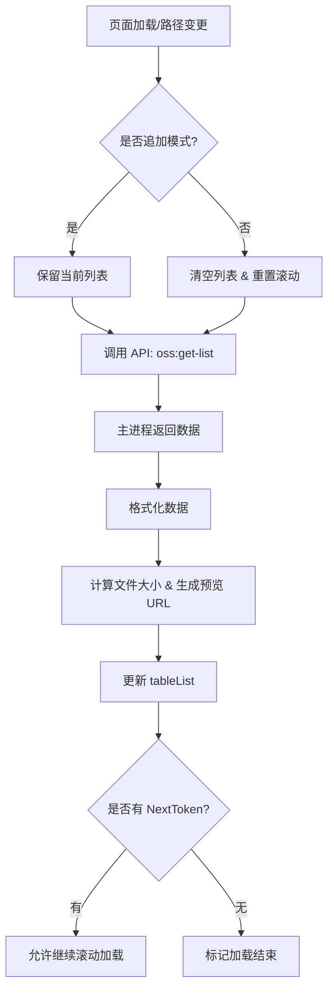
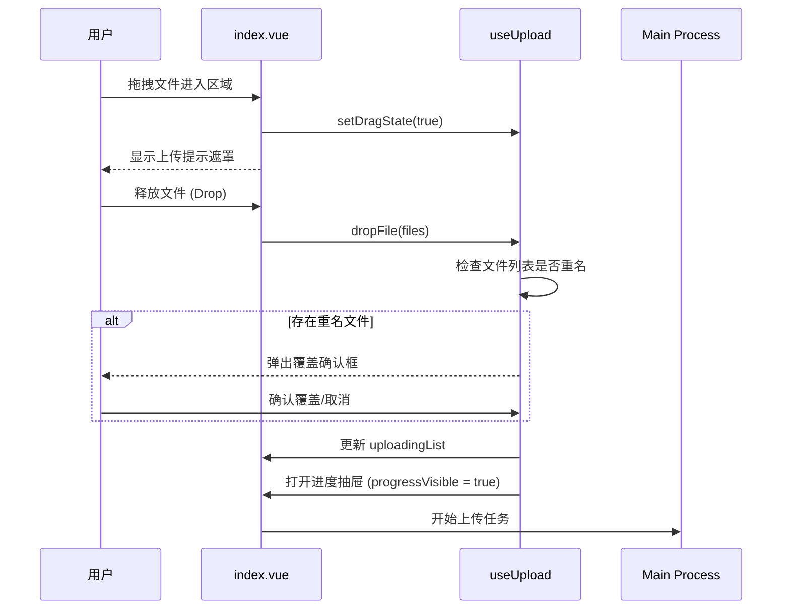

# 文件列表模块 (File List)

## 1. 核心职责
本模块是 OSS Browser 的核心视图，主要负责展示和管理对象存储（OSS）Bucket 中的文件资源。
主要功能包括：
- **文件浏览**：以列表形式展示文件和目录，支持无限滚动加载。
- **导航**：通过面包屑导航快速切换目录。
- **文件操作**：
    - **上传**：支持拖拽上传，具备重名检测和覆盖确认机制。
    - **下载**：支持单文件和批量下载。
    - **管理**：新建目录、删除文件（支持批量）、复制文件链接。
- **辅助功能**：集成收藏夹、上传历史、设置、文件预览等入口。

## 2. 关键文件索引

### 视图与组件
- `index.vue`: **[入口]** 页面主容器，负责布局、事件绑定及各子模块的组装。
- `components/FileList.vue`: **[辅助]** 用于在弹窗（如删除确认、覆盖提示）中展示简略文件列表的组件。
- `components/Progress.vue`: 上传进度抽屉组件。
- `components/Preview.vue`: 文件预览弹窗组件。
- `components/Setting.vue`: 设置弹窗组件。

### 逻辑钩子 (Hooks)
- `hooks/useTable.ts`: **[核心]** 负责文件列表的数据获取、分页逻辑、选中状态管理及批量操作（删除/下载/复制）。
- `hooks/useUpload.ts`: 处理文件拖拽、重名校验及上传任务初始化逻辑。
- `hooks/useBreadcrumb.ts`: 管理路径导航状态。
- `hooks/useTableItem.ts`: 处理单行文件的点击、预览、样式复制等操作。
- `api.ts`: 定义本模块所有与主进程通信的 IPC 接口（如 `oss:get-list`, `oss:delete` 等）。

## 3. 核心逻辑图解

### 3.1 获取文件列表流程

### 3.2 拖拽上传流程

## 4. 注意事项
- **组件命名歧义**：`components/FileList.vue` 并非主页面的文件表格，而是一个用于 Dialog 中的纯展示组件。主表格逻辑直接在 `index.vue` 中实现。
- **分页机制**：列表采用“无限滚动”而非传统分页，依赖 `oss:get-list` 返回的 `token` 判断是否还有更多数据。
- **状态管理**：大部分业务逻辑被拆分到 `hooks/` 目录下，修改特定功能（如表格行为）时应优先查看对应的 hook 文件。
