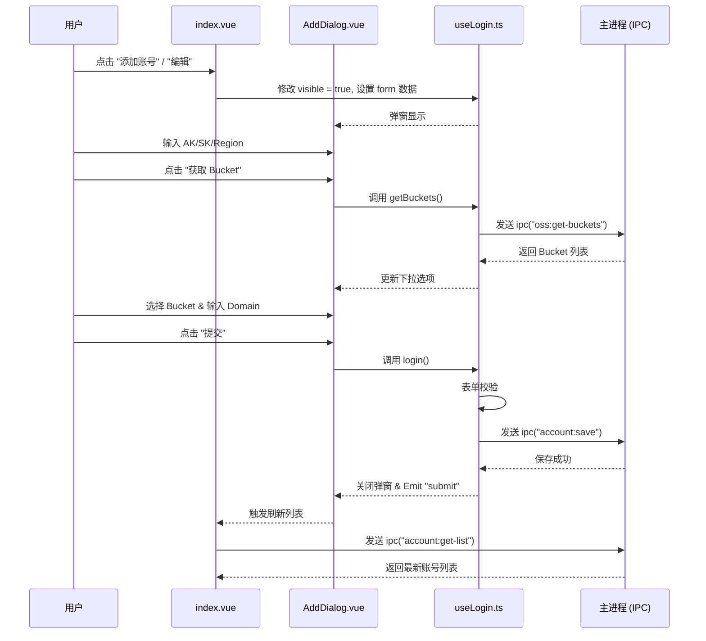
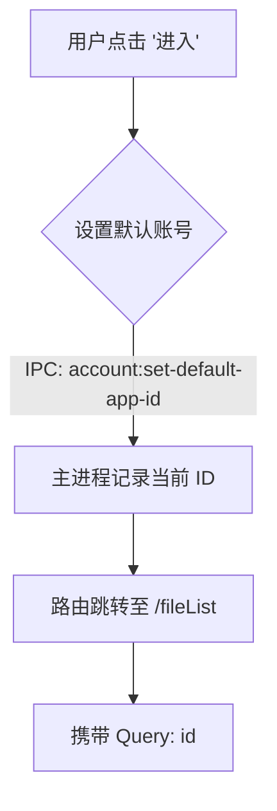

# 账号管理模块 (Home View)

## 1. 核心职责
本模块是应用的主入口，主要负责 OSS (Object Storage Service) 账号的管理。核心功能包括：
- **账号列表展示**：显示已保存的 OSS 账号信息。
- **账号增删改查**：支持添加新账号、编辑现有账号、删除账号以及复制账号配置。
- **一键登录**：点击账号即可进入文件管理页面，并自动设置为默认账号。
- **多平台支持框架**：目前主要支持阿里云 OSS，但数据结构设计上预留了多平台扩展能力。

## 2. 关键文件索引

| 文件路径 | 说明 |
| --- | --- |
| `index.vue` | **主页面**。负责展示账号列表，处理账号的增删改查入口逻辑，以及页面跳转。 |
| `components/AddDialog.vue` | **编辑/添加弹窗**。提供表单界面，用于输入 AccessKey、Secret、Region 等信息，并支持动态获取 Bucket 列表。 |
| `hooks/useLogin.ts` | **核心逻辑 Hook**。封装了表单状态管理、数据校验、IPC 通信（保存账号、获取 Bucket）等业务逻辑。 |

## 3. 核心逻辑图解

### 3.1 添加/编辑账号流程

### 3.2 账号登录跳转流程

## 4. 注意事项

1.  **平台扩展性**：
    - 目前 `getPlatformName` 和表单中的平台选择硬编码为 `1` (阿里云)。如果需要支持腾讯云或 AWS S3，需在 `index.vue` 和 `AddDialog.vue` 中扩展枚举值，并在 `useLogin.ts` 中适配相应的字段验证逻辑。
    
2.  **数据安全**：
    - AccessKeySecret 等敏感信息在前端仅做透传，实际存储和加密由主进程负责。
    
3.  **IPC 通信依赖**：
    - 本模块强依赖以下 IPC 通道，开发时需确保主进程已实现：
        - `account:get-list`
        - `account:save`
        - `account:remove`
        - `account:get-default-app-id`
        - `account:set-default-app-id`
        - `oss:get-buckets`
